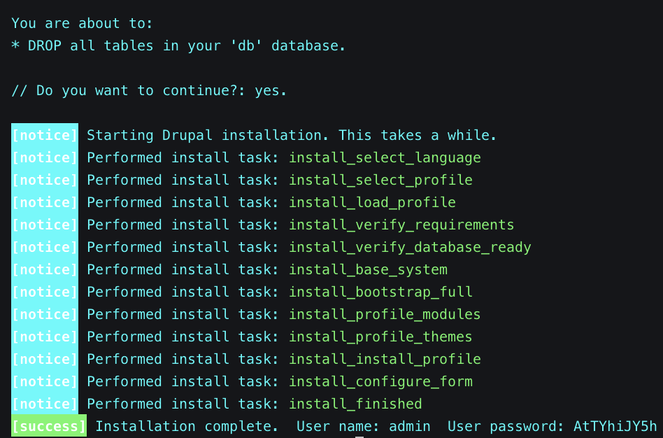
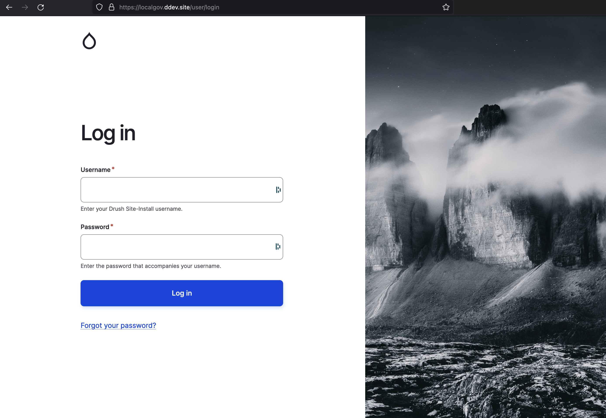

---
tags:
  - local development
  - DDEV
  - docker
  - composer
---

# Working with DDEV

## DDEV-Prerequisites

DDEV is an open-source tool for launching local web development environments in minutes. These environments can be 
extended, version controlled, and shared, so you can take advantage of a Docker workflow without Docker experience or 
bespoke configuration. Projects can be changed, powered down, or removed as easily as they’re started.

The [official DDEV requirements page](https://ddev.readthedocs.io/en/latest/) offers detailed information on the 
prerequisites that should be in place but, generally speaking, here's a list of minimum requirements for DDEV:
- Recent OS version
- RAM: 8GB
- Storage: 256GB

_Optional: You can delete the .lando.dist.yml file in the project’s root, as it is redundant when using DDEV
instead of Lando._

There are multiple ways of installing DDEV locally, mainly depending on your Operating System. Make sure you go through 
the [official DDEV installation page](https://ddev.readthedocs.io/en/latest/users/install/ddev-installation/) if your 
OS is not covered below.

## Installing DDEV on Mac OS

### DDEV on Mac OS using Homebrew

Homebrew is a popular package manager for Mac OS and Linux - it basically brings packages into your machine in an 
organised manner. It controls and manages their dependencies and versions (similar to Composer). 
To install Homebrew locally:

```bash
/bin/bash -c "$(curl -fsSL https://raw.githubusercontent.com/Homebrew/install/HEAD/install.sh)"
```

With Homebrew in place, run the following to install DDEV:

```bash
brew install ddev/ddev/ddev
```

You can confirm that DDEV is in place by checking its installed version:

```bash
ddev -v
```

### DDEV on Mac OS using Curl

To download and run the install script, run the following in your Terminal:

```bash
curl -fsSL https://ddev.com/install.sh | bash
```

## Installing DDEV on Windows
You can install DDEV on Windows in three ways:
- Using WSL2 with Docker inside
- Using WSL2 with Docker Desktop
- Installing directly on traditional Windows with an installer

DDEV strongly recommends using WSL2. While its Linux experience may be new for some Windows users, it’s worth the 
performance benefit and common experience of working with Ubuntu and Bash. You can follow the 
[official DDEV Windows installation steps](https://ddev.readthedocs.io/en/latest/users/install/ddev-installation/#wsl2-docker-desktop-install-script) 
to install DDEV using WSL2 with Docker Desktop.

## Installing DDEV on Linux

You can use Homebrew or the curl install script in most instances, as described in the Mac OS installation instructions 
above. On the [official DDEV Linux installation page](https://ddev.readthedocs.io/en/latest/users/install/ddev-installation/#linux, 
there are more installation ways listed for some Linux and Ubuntu distributions.

## Installing LocalGov Drupal locally with Composer and DDEV

If you haven't yet installed Composer and Docker Desktop, see [Getting Started](/devs/getting-started/) for instructions
on how to install these requirements.

Now that we have all the required dependencies in place (Composer, Docker Desktop and DDEV), we can create our first
LocalGov Drupal project locally.

Open your Command Prompt/Terminal/Shell and switch to an appropriate directory (for example, on Mac OS X, the ~/Sites 
folder is usually preferred):

```bash
cd ~/Sites
```

### 1. Creating the Project
Similarly to our Lando installation guide, we are going to use the LocalGov Drupal project template publicly available 
on [GitHub](https://github.com/localgovdrupal/localgov_project):


To build the LGD project locally, we need to run the following Composer command and bring all the required packages
together in a new LGD_DEMO directory (feel free to change the project name to anything else you might prefer):

```bash
composer create-project localgovdrupal/localgov-project LGD_DEMO --no-install
```

The Terminal output of this command will look something like the following:


Switch to the LGD_DEMO directory by running:

```bash
cd MY_PROJECT
```

### 2. The DDEV Part

Then, we need to initialise our DDEV project:

```bash
ddev config
```

As you can see in the screenshot below, DDEV is suggesting default values for the following:

- _Project name_ (suggested default: _locagov_)
- _Docroot location_ (suggested default: _web_)
- _Project type_ (suggested default: _drupal10_)

We complete the initialisation by hitting 'Enter' in all three suggestions so the default value is selected. The output 
of the command should look like the following:


Then, fire up DDEV:

```bash
ddev start
```

Initially, the required resources are pulled in:


Following that, the containers start running:


Every time ddev starts, the project URLs are included in the output. In our case, we have selected _localgov_ as the 
name of our project and, as a result, _https://localgov.ddev.site_ will be the first URL we can access our project on. 
The second URL, _https://127.0.0.1:65175_, uses our machine's localhost IP and an available port allocated to our ddev 
project. Both URLs can be used to access our project on our browser.

**Note**: The project will not be accessible via those URLs until you have run `composer install` in Step 3 below.

At any point (when you're done for the day, for example), you can stop the project and remove its memory usage by running:

```bash
ddev stop
```

Once DDEV has been initialised, you might also want to run:

```bash
ddev auth ssh
```

in order to enable your SSH keys for this project (this is useful for SSH authentication in case access to remote 
repositories is required). The output of this command lists all the SSH keys our container has been made aware of.

The Docker dashboard, with all our LGD demo project's DDEV containers up and running, should look something like the 
following:


### 3. The composer install Part

Now it's time to pull in all the Composer dependencies for this project:

```bash
ddev composer install
```

If it's the first time running composer install, this process can take a while because all the project's dependencies 
need to be brought in from their repositories. We have already covered the various stages of this Composer command's 
output in our 
[LGD Lando installation guide](/devs/getting-started/working-with-lando.html#localgov-drupal-local-installation-with-composer-and-lando). 
Upon re-running the same command, the Terminal should naturally inform us that there is Nothing to _install, update or 
remove_.

### 4. Building the Site with Drush

We can now finally install our site using the site install drush command (for more on drush, Drupal's popular scripting 
tool, see [https://www.drush.org](https://www.drush.org):

```bash
ddev drush si localgov -y
```

The output of the command will look something like the following:



Our new LocalGov Drupal site is now up and running locally! Remember those two project URLs returned by `ddev start` 
above? You can use either one of them, and the credentials returned from the last command, to access your Drupal 
administrator account on your brand new LGD site on your favourite browser:



Logging into your admin account will land you on the Drupal content page:


Your brand new LocalGov Drupal site is now up and running locally with DDEV. From here, you can explore all the unique 
features that come with LGD out of the box and start building your new Council website!
